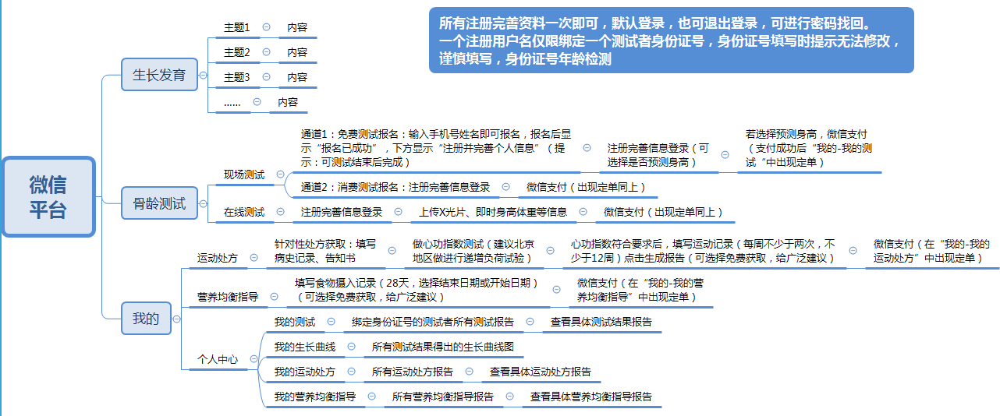
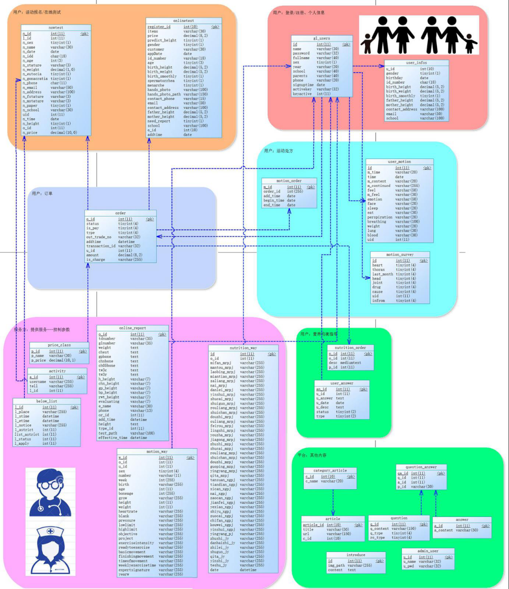
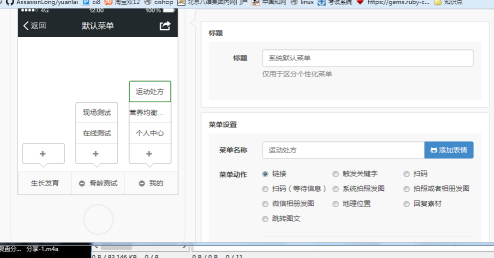

1.项目测试版网址:http://www.liujinlong.site/htjk/public/

2.测试后台(PC端):http://www.liujinlong.site/htjk/public/admin.php/index/login/login.html

如果需要后台可以提供用户名和密码

 

3.项目流程图:

 

4.项目表结构:

5.微信文档

6.微信接口对接快速开源产品

比如菜单设置如下:

7.上线beta版公众号,可以微信支付了

8.以上是我现在完成的项目,功能挺多的,目前web2.0哪有不用ajax的,比如登录验证就是ajax验证

